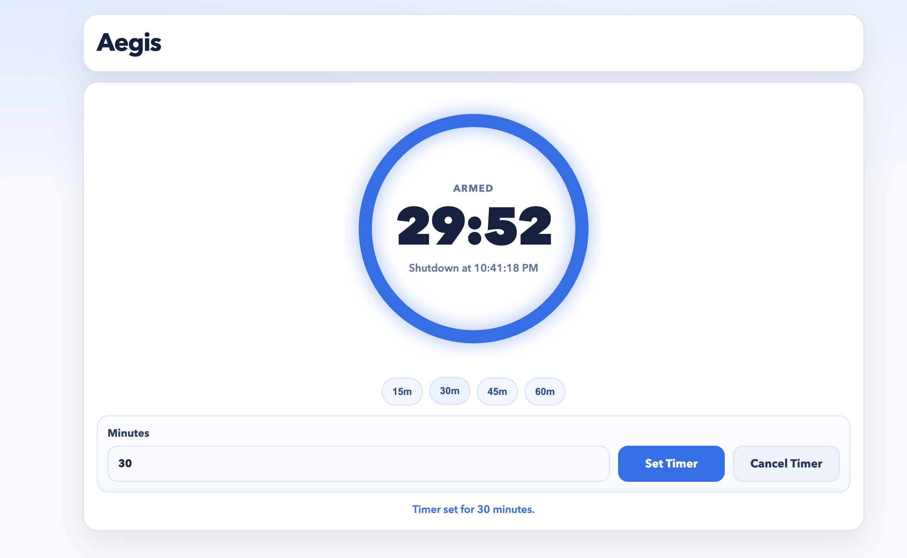

# Aegis

A self-hosted service to turn off LG TV after N minutes



## Run

```bash
python3 app.py
```

Open:
- `http://127.0.0.1:8787/`

## Run With Docker Compose

```bash
docker compose up -d
```

Then open `http://<your-ip>:8787/`.

Stop:

```bash
docker compose down
```

## LG Pairing / Power-Off

Pair once:

```bash
docker compose exec aegis python /app/scripts/lg_poweroff.py --pair-only
```

Test power-off:

```bash
docker compose exec aegis python /app/scripts/lg_poweroff.py
```

## API

### `POST /timer`

```json
{ "minutes": 45 }
```

### `POST /timer/cancel`

```json
{}
```
